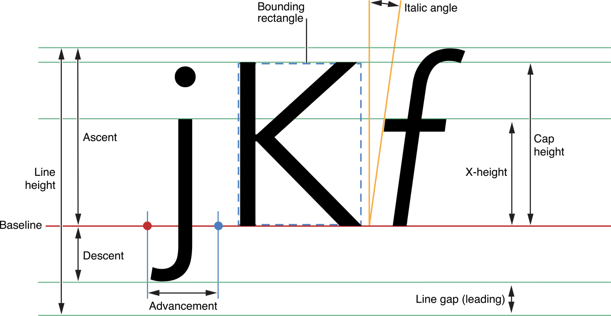

# CoreText学习笔记

## **CoreText学习笔记**

综合现有中文资料和苹果官方文档整理

**以下为引用文章地址**

[xiaoxiaobukuang的专栏](https://blog.csdn.net/xiaoxiaobukuang)

[aron1992专栏](https://my.oschina.net/FEEDFACF)

[苏屹鸡专栏](https://blog.csdn.net/mangosnow/article/list/3?)

[Core Text官方文档](https://developer.apple.com/documentation/coretext?language=objc)

[Cocoa Text Architecture Guide](https://developer.apple.com/library/archive/documentation/TextFonts/Conceptual/CocoaTextArchitecture/Introduction/Introduction.html#//apple_ref/doc/uid/TP40009459-CH1-SW1)

[Text Programming Guide for iOS](https://developer.apple.com/library/archive/documentation/StringsTextFonts/Conceptual/TextAndWebiPhoneOS/Introduction/Introduction.html#//apple_ref/doc/uid/TP40009542-CH1-SW1)

[Core Text Programming Guide](https://developer.apple.com/library/archive/documentation/StringsTextFonts/Conceptual/CoreText_Programming/Introduction/Introduction.html)

## 目录

[文字在iOS的显示](coretextxue-xi-bi-ji.md#1、文字在ios的显示)

[CoreText理论知识](coretextxue-xi-bi-ji.md#2、coretext理论知识)

### 1、文字在iOS的显示

先祭出一张神图镇楼

#### 知识准备

**Characters and Glyphs**

character是最小的具有意义的书面语言。character是一个抽象的概念，比如a，这就是一个英文字符，我们说出这个单词就能知道它代表英文26个字母的第一个。

character必须在一定区域里以可识别的形状展现，这也就是Glyph的概念，简单理解就是你知道字符a，怎么能让人在视觉上能直观看到它，并且一看到它就能知道其抽象概念，这是一个抽象到具象的过程。这也就意味着一个character并不是和glyph一一对应的。一个character可以对应多个Glyphs.

这五个a就是不同的glyph，一个glyph也可以和多个character对应。连笔\(ligature\)造成了一个glyph对应多个character。

**Typefaces and Fonts**

**typeface** 是书面语言中部分或者所有characters在视觉上相关联的形状。举个🌰 ：Times。

**typestyle**可以被认为是与typeface同一个等级的但是不同维度的样式，举个🌰 ：Roman,Itilc

**font**拥有一致的consitent size,typeface,typestyle。font像是typeface 和 typestyle 的组合，举个例子：Times Roman, Times Itilc

**font family** 是同一个typeface但是不同typestyle的font集合,比如Times roman 和 Times Italic就是属于Times family的两个不同的fonts。如下图

**Styles**, also called _**trait**s_, include variations such as bold, italic, condensed, expanded, narrow, small caps, poster fonts, and fixed pitch.Styles像是另一种划分标准。

**Text Layout**

那么需求就来了，我们的目的是将这些书面语言能展示到我们的可视化设备上，这里的可视化设备仅讨论手机。

第一个问题，第一个字在哪里写，第二个字相对第一个字又在哪里写。也就是文字展示的方向是什么，通用的是从左到右，从上到下，因为常用的中英文都是这个方式展示，所以先不讨论其他的展示方向。

紧接上一个问题，这里又会自然遇到一个场景，可视化设备是有固定的长宽的，如果从左到右触及到了可视化设备的右边界，就需要在下面一行继续显示了。这里就很自然的引入了“行”的概念。具体针对不同文字的折行规则这里就不讨论了。布局管理通过baseline来实现行这一概念，通常baseline是水平的，并且glyph的底部边界在baseline上。不过这并非绝对的，如“g”的底部就会超过baseline。这条线很像xy坐标系的x轴，那么由此也产生了一个新的概念-origin point，它代表glyph在基线上最左侧的点。下面解释一些神图上的概念。

_advance width_:\_origin point 到相邻glyph的距离

_left-side bearing_:\_origin point 到glyph left side 的空间

_right-side bearing_:\_glyph right side 到 advance 右端点的空间

_ascent_:origin point 到glyph最高点的距离

_dscent_:origin point 到glyph最低点的距离

_bounding box:_包围glyph的可见矩形

_x height:_小写“x”的高度

_cap height_:origin point 到 flat capital letters of glyphs 顶部的距离\(flat capital letter 头部为圆或尖的字母 A或者O\)

_line grap\(leading\):_铅字行线之间的距离，这个才是叫做行间距。这里我理解，这个原型应该是手工排版时期的铅条的概念，延续至今的结果，找到三篇文章可以佐证。[文章1](https://www.csdn.net/article/2012-12-04/2812467-CSS-Leading) [文章2](http://www.360doc.com/content/10/0404/20/482504_21598271.shtml) [文章3](https://en.wikipedia.org/wiki/Leading)

_line height:_ ascent + \|dscent\| + line grap

_kerning:_类似大写W和大写A，[如图](https://developer.apple.com/library/archive/documentation/StringsTextFonts/Conceptual/TextAndWebiPhoneOS/Art/kerning_2x.png),第一行为有kerning，第二行为五kerning，通常无kerning

_Alignment：_左、右、居中对齐，[图](https://developer.apple.com/library/archive/documentation/StringsTextFonts/Conceptual/TextAndWebiPhoneOS/Art/alignmentkinds_2x.png)

_justified：_左右同时对齐，[图](https://developer.apple.com/library/archive/documentation/StringsTextFonts/Conceptual/TextAndWebiPhoneOS/Art/justified_2x.png)

### 2、CoreText理论知识

**简介**

对于开发者来说coretext是设置文字显示更底层的api。

Core Text适用于与Core Graphics framework \(Quartz\)相关联的更低层处理文本技术的应用程序。如果你直接使用Quartz并且需要绘制文本。例如，你有自己的页面布局引擎，你有一些文本并且你知道这些文本需要如何显示。你可以使用Core Text来生成glyphs并且针对它们的样式如如紧排、连字、换行、连字符和对正进行的精准的位置排布。

CoreText创造glyphs（从characters 代码和font data），并在glyph运行中相对定位它们。它将glyph拆分进行，他这些行组成多行帧，例如段落。Core Text 还提供glyphs和 layout的相关数据。

